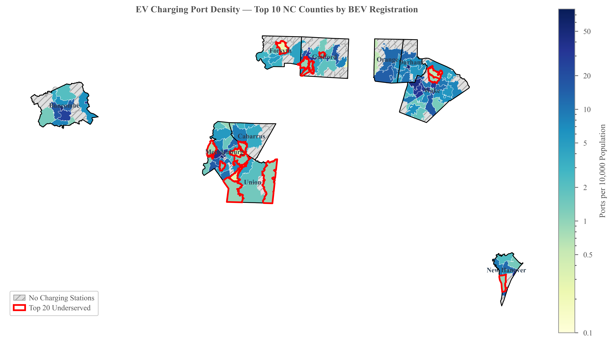
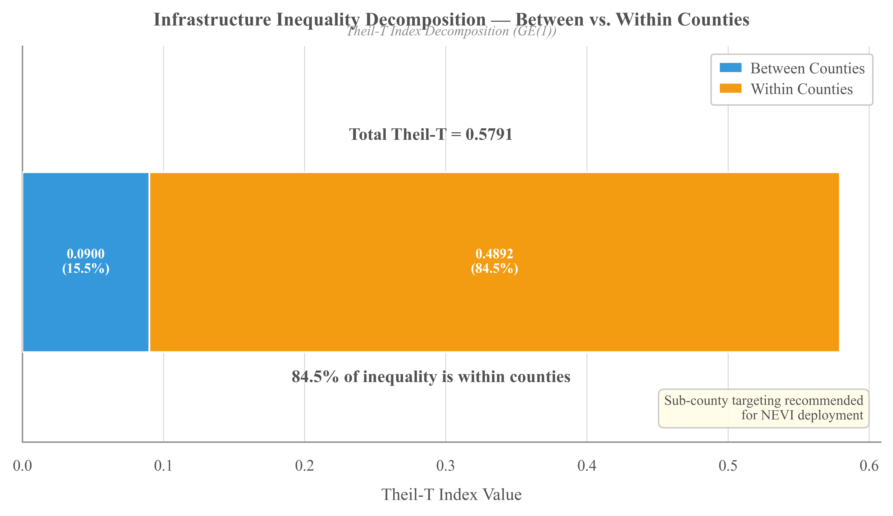
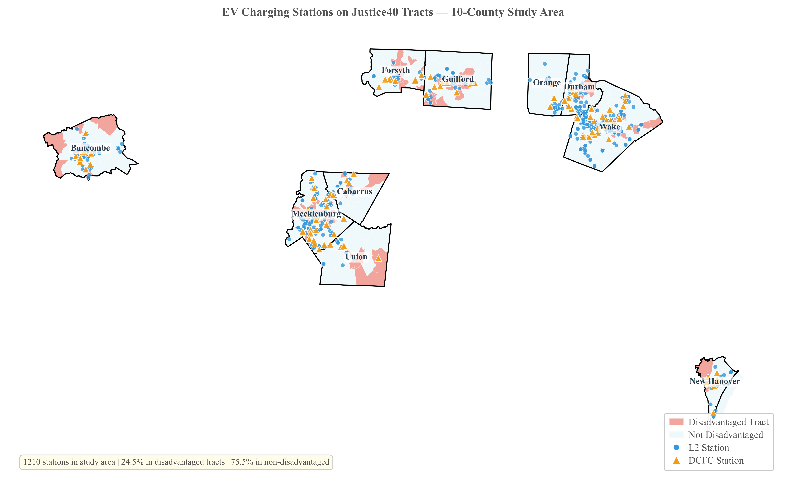
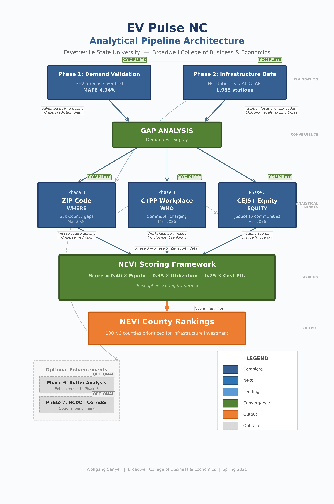

# EV Pulse NC

> **North Carolina's battery-electric vehicle fleet grew 1,727% from September 2018 to June 2025 — public charging infrastructure didn't keep pace.** This project quantifies the gap county-by-county, applies a Justice40 equity overlay, and produces a NEVI Priority Score to help direct North Carolina's $109M federal NEVI Formula Program funding.

   



*Statewide map of under-served ZIP areas. Darker shades = greater infrastructure gap relative to population. Phase 3 analysis identifies the 20 worst-served ZIPs for NEVI deployment targeting.*

---

> **At a glance:** 100 counties · 853 ZCTAs · 1,985 stations · 6,145 connectors · 43 documented Python scripts · 45 publication-grade figures (plus 4 supplementary variants) · 108-page manuscript · 100% public data

## Read the Full Paper

The full research paper is committed to this repository as a single artifact:

📄 **[ev-pulse-nc-sanyer-paper.pdf](paper/ev-pulse-nc-sanyer-paper.pdf)** — 108 pages, ~4.6 MB

The README below is the project at-a-glance; the paper is the full record — 5-phase analytical pipeline, NEVI scoring framework, methodology review documentation, and 45 publication-grade figures (plus 4 supplementary variants) with full APA 7 attribution.

---

## Executive Summary

North Carolina holds **$109M in federal NEVI Formula Program funding** for EV charging infrastructure, with no publicly available, data-driven method for prioritizing county-level allocation against the program's dual mandate of utilization efficiency and Justice40 equity. This project supplies the missing method: a 5-phase analytical pipeline that integrates NCDOT registration data, NREL AFDC infrastructure inventory, U.S. Census demographics, LEHD LODES commuter flows, and CEJST v2.0 Justice40 designations into a composite NEVI Priority Score per county.

The headline finding — that **84.5% of EV-infrastructure inequality across the top 10 NC counties lives *within* counties, not between them** — drives a two-tier scoring architecture: a county ranking, plus ZIP-level equity targeting. The top three priority counties are **Union, Mecklenburg, and Guilford**, with the ranking robust to equity-weight sensitivity, cost-effectiveness sub-weight perturbation, and remote-work multiplier cancellation. The methodology is reproducible from public data, generalizes to all 50 NEVI-funded states, and is documented for audit by federal program reviewers.

---

## Headline Findings

- **Demand explosion** — BEV registrations grew **1,727%** (Sept 2018 → June 2025); 53.8% CAGR
- **Extreme concentration** — Statewide Gini coefficient of **0.805**; top 10 counties hold 72% of all BEVs
- **Within-county inequality dominates** — Theil-T decomposition: **84.5% of ZIP-level infrastructure inequality is within counties**, only 15.5% between
- **Infrastructure scope** — 1,985 stations / 6,145 connectors (AFDC, Feb 2026; all levels L1/L2/DCFC)
- **Justice40 overlay** — **43.0%** of NC census tracts disadvantaged per CEJST v2.0; 24.5% of stations sit in those tracts
- **Forecasting validation** — Python-replicated ARIMA matches SAS Model Studio at **MAPE = 4.36%**

## NEVI Priority Top 3

| Rank | County | NEVI Score | Archetype |
|---:|---|---:|---|
| 1 | Union | 0.561 | Utilization-driven (high BEV/port ratio) |
| 2 | Mecklenburg | 0.548 | Equity-driven (Justice40 + Gini) |
| 3 | Guilford | 0.465 | Balanced |

*The full top-10 scoring output (`scoring-framework-final.csv`) is generated locally by running the pipeline and is not committed to the repository (it is reproducible from the scripts; statewide all-100-county scoring is future work). See [`frameworks/analytical-pipeline.md`](frameworks/analytical-pipeline.md) for the scoring formula (`0.40·Equity + 0.35·Utilization + 0.25·Cost-Effectiveness`).*

---

## What This Work Contributes

Five contributions to the EV-infrastructure-allocation literature, each substantiated in the paper:

1. **Additive Theil-T decomposition applied to EV equity.** Where prior work (e.g., Choi, Xu & Jiao 2025) uses the Theil index as a single scalar alongside Gini and Lorenz, this study exploits the additive decomposability of the GE(1) class (Bourguignon 1979; Shorrocks 1980) to partition inequality into between-county (15.5%) and within-county (84.5%) components — verified to machine precision via a Theil-L robustness check (82.5%).

2. **First HUD USPS × CEJST integration at ZCTA resolution in NC.** Area-weighted spatial crosswalk between Census tracts and ZCTAs, aligned with EPA EJScreen and HUD USPS federal-standard methodology, integrated with CEJST v2.0 Justice40 designations. Passes 23 of 23 federal-standard validation checks.

3. **NEVI-specific scoring formulation with documented orthogonality and triple robustness.** Composite score `0.40·Equity + 0.35·Utilization + 0.25·Cost-Effectiveness`, with statistically independent pillars (max VIF = 1.41 vs. conventional concern threshold 5.0) and a top-3 ranking that survives equity-weight sensitivity (0.30–0.50 range), cost-effectiveness sub-weight perturbation, and the mathematically demonstrated cancellation of the remote-work multiplier.

4. **Empirical demonstration that within-county inequality dominates.** Most state NEVI programs allocate at county level; this study quantifies that county-level allocation alone would miss **84.5%** of the equity problem within NC's top-10 cohort.

5. **Direction-of-bias limitations framing + AI-assisted role-play methodology review panels.** A sole-author project formalizing multi-perspective review through pre-registered claims matrices and panel-anchored repository commits. Standalone artifacts: [`data-quality-review.pdf`](docs/research/data-quality-review.pdf) (short) · [`data-quality-review-full.pdf`](docs/research/data-quality-review-full.pdf) (full). The AI methodology disclosure is included in the paper as Appendix B. Integrated treatment in paper Appendices A & B.

---

## Featured Findings

### Theil decomposition — where the inequality lives



*84.5% of NC's ZIP-level infrastructure inequality is within counties, not between them. **Policy implication:** county-level fund allocation alone won't close the gap — ZIP-level deployment targeting is required.*

### Justice40 alignment



*Charging stations overlaid on Justice40-disadvantaged census tracts. 24.5% of NC's mapped stations sit in disadvantaged tracts — close to proportional to the disadvantaged-tract share (43.0%) but with strong regional variation.*

---

## Methodology — 5-Phase Pipeline



*Two foundation phases (Phase 1 demand validation + Phase 2 infrastructure inventory) converge at Gap Analysis. Three analytical lenses (Phase 3 ZIP-level, Phase 4 workplace, Phase 5 equity) then feed a prescriptive NEVI scoring framework that produces ranked county allocations.*

1. **Phase 1 — Validation:** Python ARIMA replication of SAS Model Studio county-level BEV forecasts (MAPE 4.36%; 100 counties; 8 publication figures)
2. **Phase 2 — Infrastructure inventory:** Full AFDC API pull (Feb 2026); 1,985 stations, 6,145 connectors, all charging levels
3. **Phase 3 — ZIP/County equity:** Gini coefficient (0.805 demand-side; 0.566 supply-side weighted) + Theil decomposition (84.5% within-county); 134 ZIPs ranked; 27 figures
4. **Phase 4 — Workplace charging:** LEHD LODES 2021 commuting flows + ACS income/tenure; 859,260 adjusted statewide workplace-charging demand; Mecklenburg/Wake/Durham top 3
5. **Phase 5 — Justice40 equity overlay:** CEJST v2.0 disadvantaged-community designation + climate-sensitivity check + weight-sensitivity grid
6. **Scoring framework:** Composite NEVI Priority Score per county = `0.40·Equity + 0.35·Utilization + 0.25·Cost-Effectiveness`; VIF-checked for multicollinearity

Full pipeline spec: [`frameworks/analytical-pipeline.md`](frameworks/analytical-pipeline.md). Per-dataset schema: [`data/DATA-DICTIONARY.md`](data/DATA-DICTIONARY.md). Model locations: [`output/models/README.md`](output/models/README.md).

---

## What This Study Does NOT Claim

In the spirit of the paper's direction-of-bias limitations framing:

- **This is decision-support, not decision-making.** NCDOT will and should incorporate factors this study does not model — right-of-way constraints, utility coordination, supply-chain timing, and political prioritization.
- **Rankings are within-cohort, not statewide.** The composite NEVI Priority Score is calibrated to the top 10 NC counties (~73% of statewide BEV fleet). All-100-county application is the most immediate within-state extension.
- **Justice40 data is archived against a decommissioned federal source.** CEJST v2.0 was decommissioned by the federal government in January 2025; this study works against the community archive maintained by the Environmental Data and Governance Initiative (EDGI). A CEJST successor re-analysis is on the future-work list.
- **Workplace charging demand is estimated, not measured.** Phase 4 uses LEHD LODES 2021 commuter flow data; session-level charging utilization data was not available. Estimates are bounded in the paper.

---

## Who This Is For

Six audiences, each with categorically distinct contributions:

- **NCDOT and FHWA reviewers** — a ranked priority list whose statistical defensibility matches the federal-funding decision it informs
- **Justice40 auditors** — a 23-of-23 crosswalk validation suite paired with the CEJST archival pathway disclosure
- **County and regional planners** — sub-county (ZIP-level) granularity for site selection
- **Private-sector charging operators** — a competitive baseline at ZIP resolution, with infrastructure gap analysis
- **The academic community** — a reproducible analytical pipeline, a Claims-to-Evidence Matrix (paper Appendix A), and two methodology review processes (paper Appendices A & B)
- **Justice40-eligible communities** — procedural transparency: the methodology is public, the equity weight is the largest of the three pillars, and every claim is reproducible from this repository

---

## Beyond North Carolina

The federal NEVI Formula Program is a national $5B program across all 50 states. Every state has the same data inputs available: a state DOT registration analog, the NREL AFDC API, Census LEHD LODES commuter flows, and CEJST v2.0 Justice40 designations. State-by-state calibration would tune the equity weight against each state's specific Justice40 priorities, but **the analytical pipeline transfers without modification.**

The methodology is the deliverable; North Carolina is the proof. Other states can apply the same architecture to their own NEVI allocation decisions, and the framework is engineered for the all-100-NC-counties extension that is the most immediate within-state next step.

---

## Quickstart — reproduce the top-3 NEVI ranking in under 5 minutes

```bash
# 1. Clone (requires Git LFS — see https://git-lfs.github.com/)
git clone https://github.com/wolfieman/ev-pulse-nc.git
cd ev-pulse-nc

# 2. Pull LFS-managed datasets (~190 MB)
git lfs pull

# 3. Set up the Python environment (uses uv — install via https://docs.astral.sh/uv/)
uv sync

# 4. Run the scoring framework — produces the top-3 ranking shown above
uv run code/python/analysis/scoring_framework_skeleton.py
uv run code/python/analysis/scoring_framework_final.py
```

You've reproduced the headline finding if the final script prints:

```
[CHECK 5] Intuition checks:
    Top 3: ['Union', 'Mecklenburg', 'Guilford']
    PASS — Guilford/Mecklenburg in top 3 as expected
```

Total elapsed time: under 5 minutes on a modern laptop.

---

## Full Reproducibility

To regenerate every output (all 45 figures plus supplementary variants, all CSVs, all phases) from raw inputs:

```bash
# Phase 1 — Validation
uv run code/python/analysis/validate_sas_forecasts.py
uv run code/python/analysis/generate_phase1_figures.py
uv run code/python/analysis/arima_bev_forecast.py

# Phase 3 — ZIP/County equity
uv run code/python/analysis/phase3_zip_mapping.py
uv run code/python/analysis/phase3_zip_density.py
uv run code/python/analysis/phase3_gini_inequality.py
uv run code/python/analysis/phase3_theil_decomposition.py
uv run code/python/analysis/phase3_top20_underserved.py
uv run code/python/analysis/phase3_county_heatmaps.py
uv run code/python/analysis/phase3_fig25_underserved_choropleth.py
uv run code/python/analysis/phase3_fig26_to_fig29.py
uv run code/python/analysis/phase3_fig30_to_fig32.py
uv run code/python/analysis/phase3_fig33_fig34.py

# Phase 4 — Workplace charging
uv run code/python/analysis/phase4_workplace_charging.py
uv run code/python/analysis/phase4_fig35_to_fig38.py

# Phase 5 — Justice40
uv run code/python/analysis/phase5_tract_zcta_crosswalk.py
uv run code/python/analysis/phase5_climate_sensitivity.py
uv run code/python/analysis/phase5_weight_sensitivity.py
uv run code/python/analysis/phase5_fig39_to_fig42.py

# Scoring framework (sequential — final reads skeleton's output, VIF reads final's output)
uv run code/python/analysis/scoring_framework_skeleton.py
uv run code/python/analysis/scoring_framework_final.py
uv run code/python/analysis/scoring_framework_vif.py
```

**Notes:**

- Raw data is fetched from `data/raw/` (LFS-tracked). To re-fetch from source APIs, see scripts in `code/python/data-acquisition/`.
- `data/processed/` outputs are gitignored — they regenerate from the scripts above. The `phase3_zip_mapping.py` step depends on the consolidated AFDC CSV being present in `data/raw/`.
- `output/figures/` is committed in the repo (PDF + PNG, 600 DPI). Re-running the figure scripts overwrites them in place.

---

## Tech Stack

- **Python 3.14+** — primary analytics platform
  - **pandas / numpy** — data manipulation
  - **statsmodels** — ARIMA / SARIMA / exponential smoothing forecasts; VIF; Ljung-Box
  - **geopandas / shapely** — spatial joins (NC State Plane EPSG:32119), choropleths
  - **matplotlib / seaborn** — publication-quality figures (600 DPI, PDF + PNG)
  - **requests / openpyxl** — API ingestion + Excel I/O
- **SAS Model Studio** — reference forecasts (auto-selected ESM × 82, ARIMA × 13, UCM × 5 across 100 counties)
- **Git LFS** — large data files (~190 MB total: CSVs, GeoJSONs, Excel)
- **uv** — Python dependency manager (replaces pip + venv + pip-tools)

### Analytical Framework (5-part)

Exploratory → Descriptive → Diagnostic → Predictive → Prescriptive. Applied across the 5 phases above.

---

## Repository Structure

```
ev-pulse-nc/
├── README.md                     # This file
├── CITATION.cff                  # Machine-readable citation metadata
├── INSTALLATION.md               # Setup guide
├── QUICK-REFERENCE.md            # Daily workflow commands
├── LICENSE                       # Polyform Noncommercial License 1.0.0
├── NOTICE.md                     # Copyright notice
├── .gitignore                    # Git ignore patterns
├── .gitattributes                # Git LFS tracking rules
│
├── data/                         # Dataset directory (Git LFS)
│   ├── raw/                      # Original datasets
│   ├── processed/                # Analysis-ready outputs (CSVs gitignored, regenerable)
│   ├── reference-forecasts/      # SAS Model Studio outputs (LFS)
│   ├── DATA-DICTIONARY.md         # Column definitions for all datasets
│   └── README.md                 # Directory overview & provenance
│
├── code/
│   └── python/                   # Python scripts
│       ├── data-acquisition/     # API ingestion scripts (AFDC, Census, LEHD, CEJST)
│       ├── analysis/             # Phase 1-5 + scoring scripts
│       ├── blog/                 # Blog graphics package
│       └── docs/                 # Documentation-asset generators (e.g. pipeline diagram)
│
├── docs/                         # Project documentation
│   ├── eda-reports/              # Exploratory data analysis reports
│   ├── figures/                  # Pipeline diagram + thumbnails
│   ├── internal/                 # Internal working artifacts (drift audits, AI logs)
│   └── research/                 # Supporting research papers + literature checks
│
├── frameworks/                   # Analytical frameworks and methodology specs
│   ├── analytical-pipeline.md    # Full 5-phase pipeline + scoring formula
│   ├── afdc-dataset-reference.md # AFDC source, vintage, counts
│   ├── afdc-data-structure.md    # AFDC field-level schema
│   └── ...                       # Per-dataset and per-method docs
│
├── output/                       # Generated outputs
│   ├── figures/                  # 45 publication-quality figures + supplementary variants (PDF + PNG)
│   ├── validation/               # Forecast validation results
│   └── models/                   # Model index — pointers to where each model lives
│
├── paper/                        # Research paper directory
│   ├── README.md                 # Build pipeline + canonical artifact pointer
│   └── ev-pulse-nc-sanyer-paper.pdf  # The full research paper (108 pages)
│
└── references/                   # Supporting materials
    └── data-sources.md           # Citations & links
```

### Key Documentation

| Document | Description |
|----------|-------------|
| 📄 [paper/ev-pulse-nc-sanyer-paper.pdf](paper/ev-pulse-nc-sanyer-paper.pdf) | **The full research paper** — 108 pages, includes Claims-to-Evidence Matrix (App. A) and AI methodology disclosure (App. B) |
| [docs/research/data-quality-review.pdf](docs/research/data-quality-review.pdf) | Standalone **data quality review** — short version (also paper Appendix A) |
| [docs/research/data-quality-review-full.pdf](docs/research/data-quality-review-full.pdf) | Standalone **data quality review** — full version with all panel transcripts |
| [CITATION.cff](CITATION.cff) | Machine-readable citation metadata (powers GitHub's "Cite this repository" button) |
| [frameworks/analytical-pipeline.md](frameworks/analytical-pipeline.md) | Full 5-phase pipeline and NEVI scoring formula |
| [data/DATA-DICTIONARY.md](data/DATA-DICTIONARY.md) | Column definitions for all 6 datasets (NCDOT, AFDC, SAS, LEHD, CEJST, ACS) |
| [CONTRIBUTING.md](CONTRIBUTING.md) | Contribution guidelines, branching model |
| [STYLE-GUIDE.md](STYLE-GUIDE.md) | Code style, naming conventions, formatting |
| [INSTALLATION.md](INSTALLATION.md) | Full setup guide (from clone or from scratch) |
| [output/models/README.md](output/models/README.md) | Model index — where every model in the project lives |
| [references/data-sources.md](references/data-sources.md) | Data source citations and reference links |

---

## Citation

This work is citable. Click **"Cite this repository"** in the right-hand sidebar of the GitHub page, or open [`CITATION.cff`](CITATION.cff) directly for the raw metadata.

If you reference the methodology, cite the full paper at [`paper/ev-pulse-nc-sanyer-paper.pdf`](paper/ev-pulse-nc-sanyer-paper.pdf) or use the [`CITATION.cff`](CITATION.cff) metadata above.

---

## Acknowledgments

- **Author:** Wolfgang Sanyer — sole author of the analysis, code, and manuscript
- **Faculty Advisor:** Dr. Majed Al-Ghandour, Fayetteville State University
- **Data Providers:**
  - North Carolina Department of Transportation (NCDOT) — vehicle registrations
  - U.S. Department of Energy / NREL — Alternative Fuels Data Center (AFDC) charging-station inventory
  - U.S. Census Bureau — American Community Survey (ACS), TIGER boundaries, ZCTA crosswalks
  - U.S. Census Bureau / Center for Economic Studies — LEHD LODES workplace commuting data
  - Climate and Economic Justice Screening Tool (CEJST v2.0) — Justice40 disadvantaged-community designation; archived by Public Environmental Data Partners after the federal source went offline

### Methodology Review & AI Disclosure

Two methodology review processes were executed for this project, both formalized as AI-assisted role-play panels anchored to fixed repository commits and pre-registered claims matrices:

- **Data quality review** — structured panel review of data provenance, processing integrity, and reproducibility across all five analytical phases. Standalone: [`docs/research/data-quality-review.pdf`](docs/research/data-quality-review.pdf) (short) and [`docs/research/data-quality-review-full.pdf`](docs/research/data-quality-review-full.pdf) (full). Integrated treatment in paper Appendix A.
- **AI methodology disclosure** — full disclosure of AI tool usage across the analytical pipeline, methodology review processes, and manuscript preparation. Included in the paper as Appendix B.

The author retains sole authorship and verification responsibility for every claim in this project.

---

## License

[Polyform Noncommercial License 1.0.0](LICENSE) — research, academic, and public-interest use permitted; commercial use restricted. See also [`NOTICE.md`](NOTICE.md).
